# Architecture Flow Diagrams

## Overall System Architecture

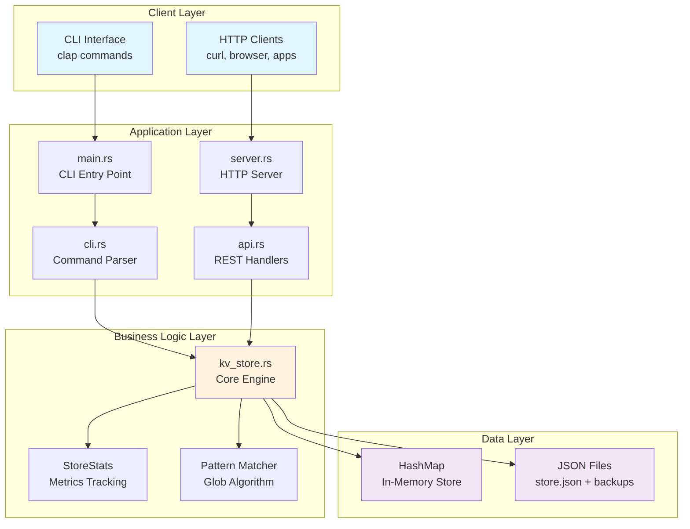

## CLI Request Flow

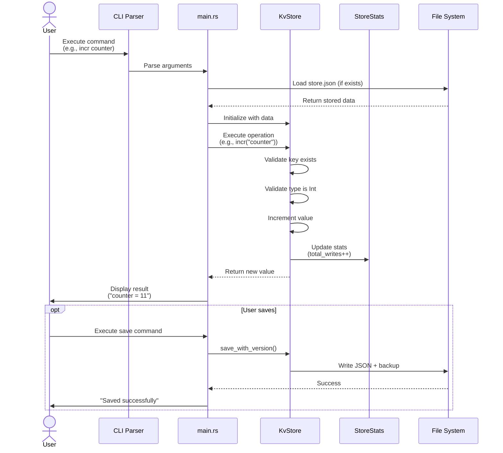

## API Request Flow

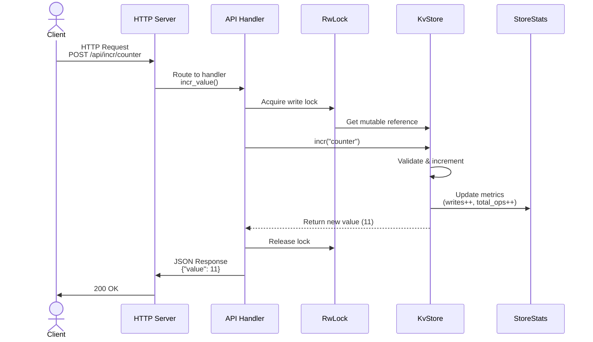

## Core Operations Flow

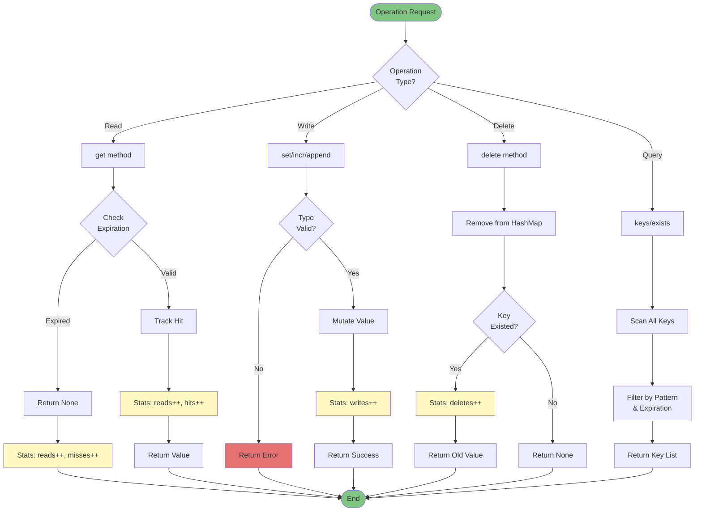

## Atomic Operation Flow (INCR/DECR)

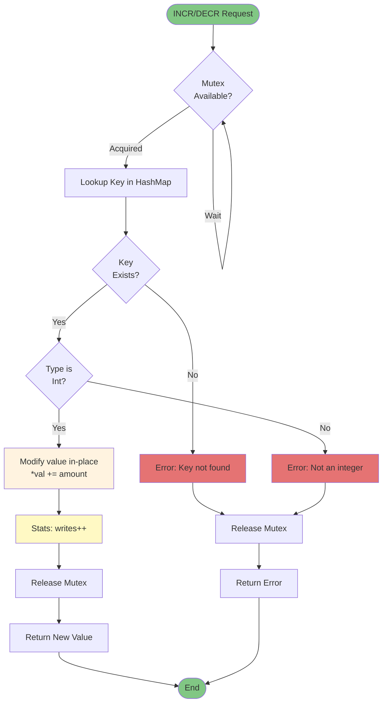

## Batch Operations Flow (MGET/MSET)

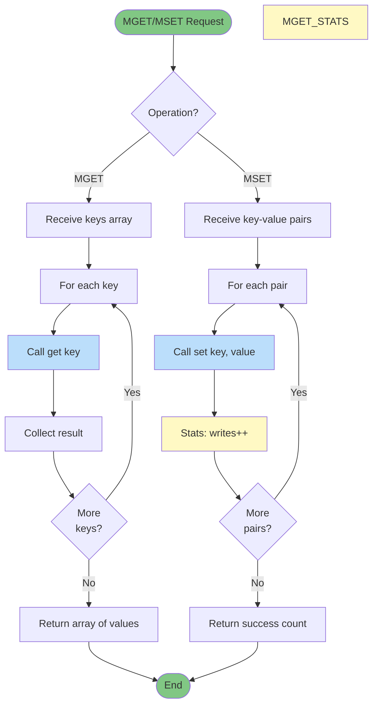

## Pattern Matching Algorithm

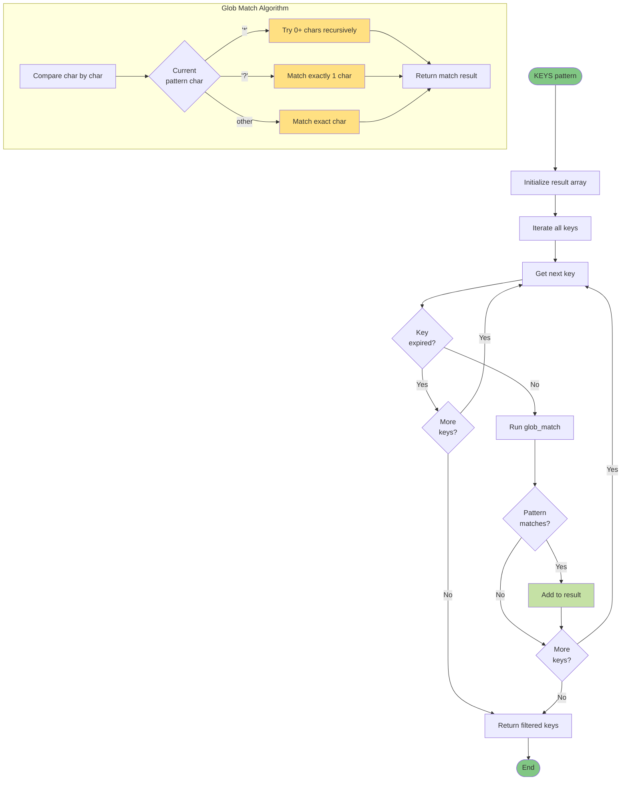

## Persistence & Backup Flow

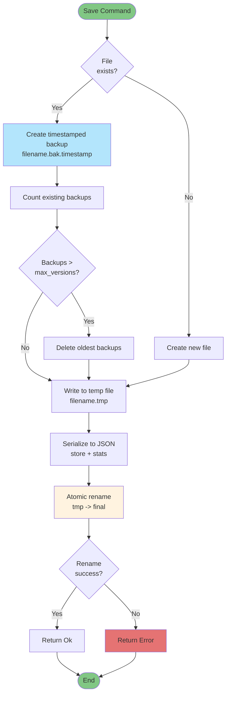

## Statistics Tracking Flow

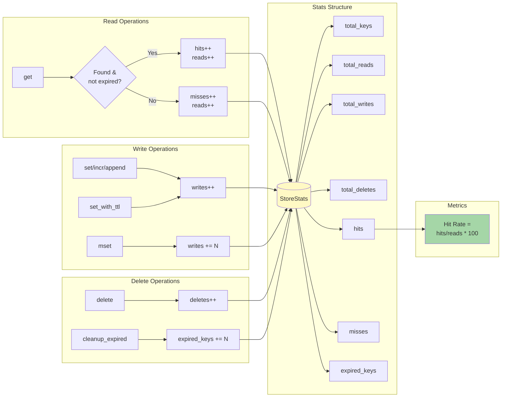

## Data Type Safety Flow

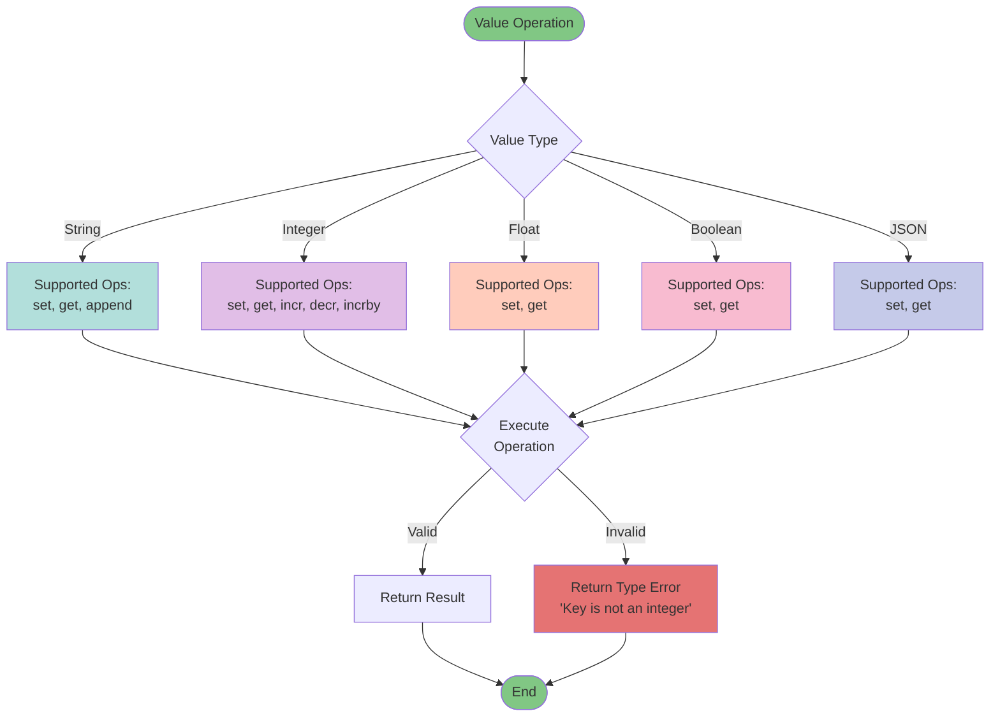

## Concurrency Model (API Server)

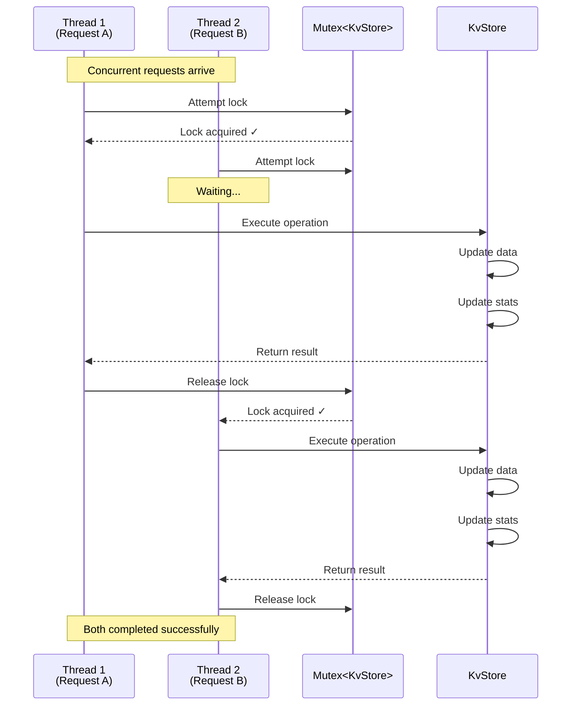

## Error Handling Flow

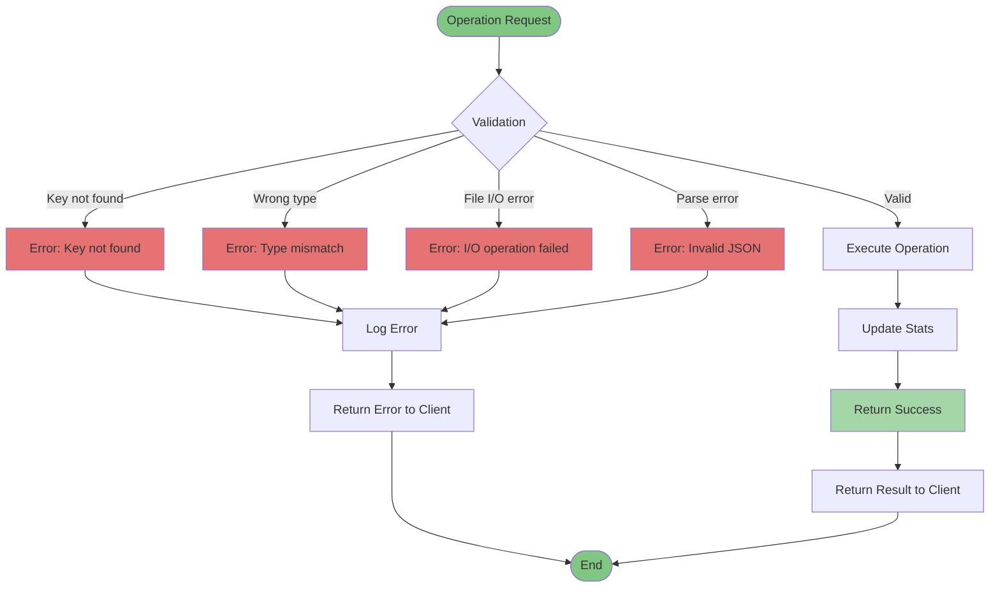

---

## How to Update These Diagrams

These diagrams use [Mermaid](https://mermaid.js.org/) syntax and can be:
1. **Viewed on GitHub** - Automatically rendered in markdown
2. **Edited in VS Code** - Install Mermaid extension
3. **Updated in any text editor** - Edit the mermaid code blocks
4. **Exported to images** - Use Mermaid CLI or online editor

### Quick Reference

- `graph TB` - Top to bottom flowchart
- `sequenceDiagram` - Sequence diagram
- `flowchart TD` - Detailed flowchart
- `-->` - Arrow connection
- `{Decision}` - Diamond shape for decisions
- `[Process]` - Rectangle for processes
- `([Start/End])` - Rounded rectangle
- `style NODE fill:#color` - Color nodes
